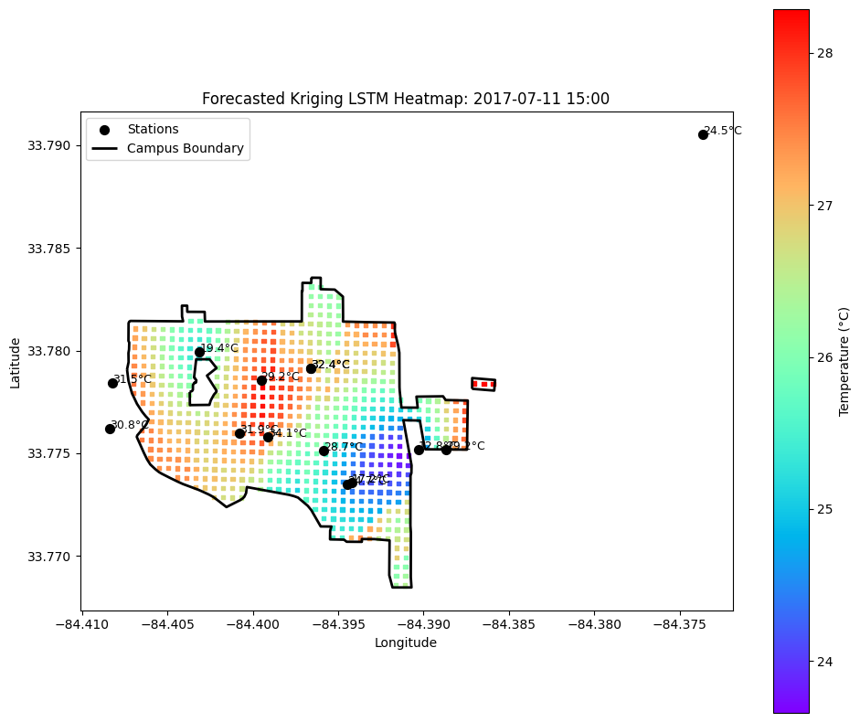
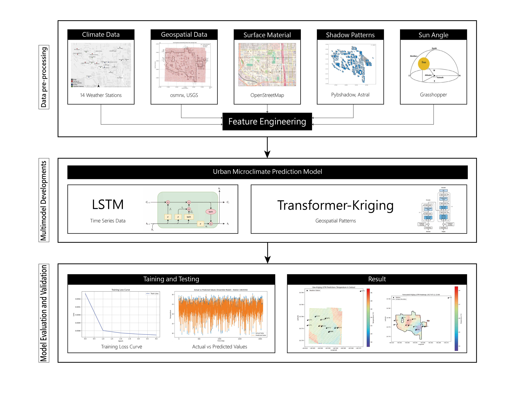

# Urban-Microclimate-Prediction-Hybrid-LSTM-Transformer-Kriging
Course Project for Arch 8833-Data-driven Methods in Design and Sustainability

# 🌦️ Microclimate Prediction Model

## 🧭 Overview

This project introduces a hybrid machine learning approach for urban microclimate prediction. It integrates time series forecasting (using LSTM and Transformer architecture) with spatial interpolation (Kriging) to model environmental conditions across the urban canopy layer.

Key inputs include:
- Meteorological data: temperature, humidity, dew point
- Urban features: land cover, 3D elevation, surface materials, shadow coverage, sun angle

---

## 🌐 Geospatial Feature Engineering

### 2D Spatial Data
- 12 distance vectors per grid point to features such as buildings, libraries, parks, trees
- Data sourced from OSMnx and GT Tree Viewer

### Building Elevation
- Derived from DSM and DTM to compute building heights

### Building Area Density
- Total building footprint per spatial unit

### Surface Materials
- OSM map tiles converted to material categories by pixel color

### Shadow Coverage
- Calculated using Pybdshadow and Astral for sunlight/shadow estimation

### Sun Angle Dynamics
- Sun angle included as a physical feature for seasonal generalization

---

## 📁 Project Structure
- **Data Collection**: Automated via Selenium
- **Feature Engineering**: Spatial and environmental attributes
- **Modeling**: Temporal Fusion Transformer with LSTM-Attention Encoder (TFT-LAE)
- **Training**: Adam optimizer + MSE loss + early stopping
- **Evaluation**: RMSE, MAPE, R², residual tracking

---

## 🧠 Model Architecture: TFT-LAE

- **VSN**: Variable Selection Network
- **Time2Vec**: Temporal embedding module
- **LSTM + Attention**: Captures time dependencies
- **GRN Decoder**: Multi-step forecast generation

Workflow: Input → VSN → Time2Vec → LSTM+Attention → GRN → Output

---

## 🧮 Feature Engineering & Selection

Selected Features:
- Meteorological: RH, DewPt, Azimuth, Altitude, ΔTemp
- Temporal: hour_sin, hour_cos
- Scaled with MinMaxScaler to ensure consistency

---

## 🏋️‍♂️ Training Process
- **Loss**: MSE
- **Optimizer**: Adam with weight decay
- **Early stopping**: Prevents overfitting
- **Logging**: tqdm + best model saving

---

## 🌍 Evaluation Process

### Data Sources
| Source | Use | Location |
|--------|-----|----------|
| Atlanta Weather | Train time series | Atlanta, GA |
| Singapore Grid | Train spatial Kriging | Singapore |
| GT Campus | Final test | Georgia Tech |

### Tools
- Selenium for data scraping
- Python for processing

### Workflow
1. Scrape and clean data
2. Train time series model (Atlanta)
3. Train spatial interpolation (Singapore)
4. Apply both to Georgia Tech data
5. Evaluate with real measurements

---

## 📊 Evaluation and Prediction

Functions:
- `predict_and_plot`, `plot_full_sequence`

Metrics:
- RMSE, MAPE, R²

Residuals:
- Histogram and time-series plots to detect bias

Overfitting:
- Train/test error comparison

---

## 🐞 Problem: Outlier Distortion

Initial training data contained extreme values:
- **-51°C to 174°C**

Distorted MinMaxScaler and flattened predictions.

### Solution
- Filtered to **-15°C to 40°C**
- Result: Better scaling, more generalization

Lesson: Always validate input ranges before normalization.

---

## 📉 Post-Fix Evaluation
- Residuals became balanced and centered
- Predictions improved but remained smooth
- Future work: increase expressiveness and precision

---

## ✅ Summary

This workflow combines spatial and temporal modeling for urban microclimate forecasting using:
- Deep learning (TFT-LAE)
- Spatial Kriging interpolation
- Automated feature extraction and evaluation

It provides a framework for scalable, data-driven urban climate resilience solutions.

